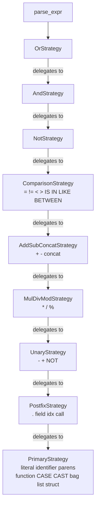
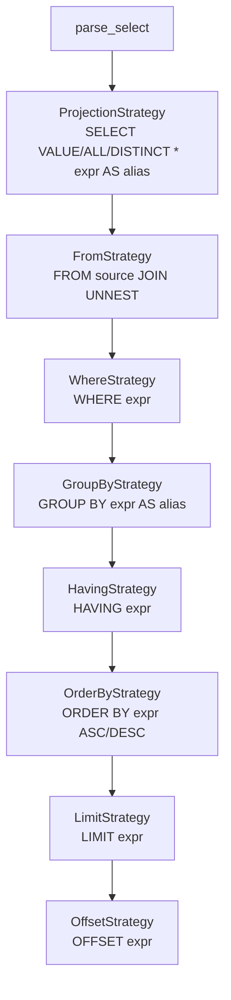
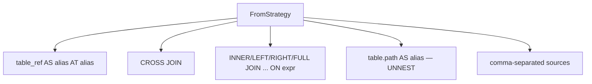
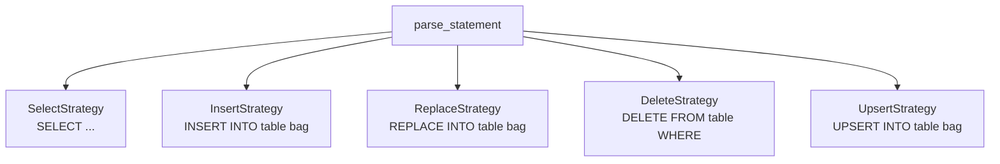
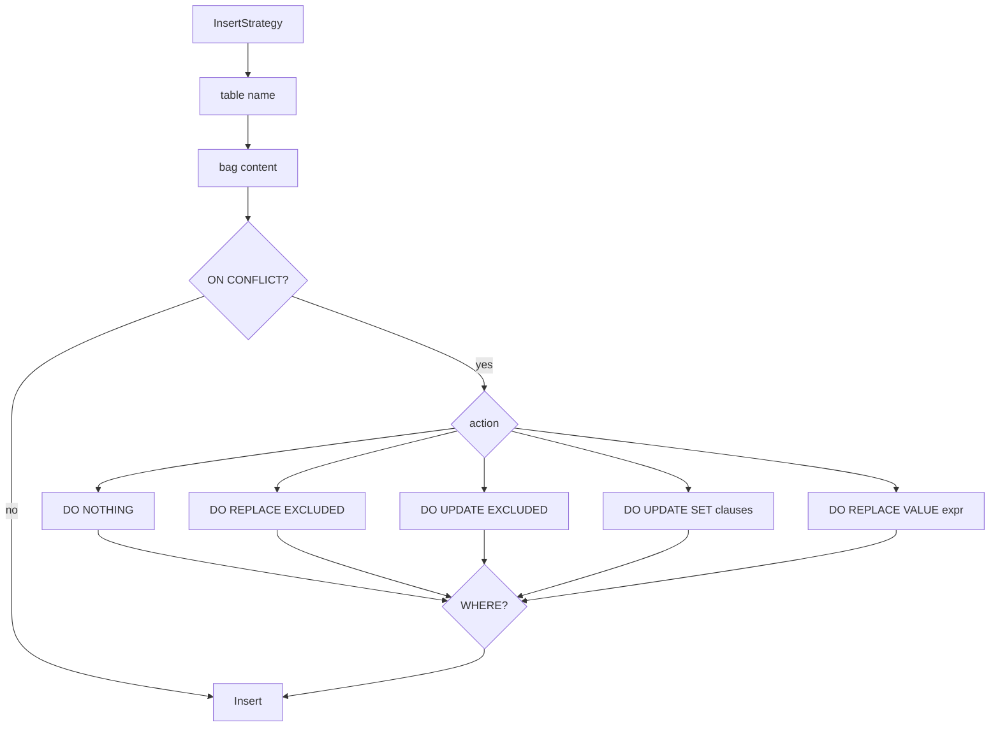

# ADR-002: LALRPOP → winnow Parser Migration Plan

**Status**: Proposed
**Date**: 2026-04-06
**Branch**: `feature/winnow-parser`

## Goal

Replace LALRPOP grammar-driven parser with winnow combinator parser for 10-50x faster parsing. Keep the existing public API (`Parser::parse` → `Parsed`) unchanged.

## Migration Strategy: Parallel Parsers

Both parsers coexist during migration. A feature flag selects which one runs. Every step produces a working, testable state.

```
partiql-winnow-parser/          # NEW: separate crate
├── Cargo.toml                  # depends on partiql-ast, partiql-common, winnow
├── src/
│   ├── lib.rs                  # WinnowParser::parse() → Parsed (same API as Parser)
│   ├── helpers.rs              # kw(), ws(), identifier(), quoted_string()
│   ├── literal.rs              # Strings, numbers, booleans, null, Ion
│   ├── expr.rs                 # Expression precedence (OR > AND > ... > primary)
│   ├── select.rs               # SELECT, FROM, WHERE, GROUP BY, ORDER BY, LIMIT
│   ├── dml.rs                  # INSERT, DELETE, REPLACE, UPSERT, ON CONFLICT
│   ├── from.rs                 # FROM clause: table refs, JOIN, UNNEST, aliases
│   ├── projection.rs           # SELECT projection: *, expr AS alias, VALUE
│   └── error.rs                # Error types compatible with partiql-parser errors
└── tests/
    └── parity.rs               # Run same inputs through both parsers, diff ASTs

partiql-parser/                 # EXISTING: untouched
├── src/
│   ├── parse/partiql.lalrpop   # LALRPOP grammar (stays)
│   └── ...
```

The existing `partiql-parser` crate is untouched. FDE switches its dependency from `partiql-parser` to `partiql-winnow-parser` when ready. Both produce the same `partiql-ast` types.

## Crate Swap (no feature flags)

FDE's `Cargo.toml` switches from one crate to the other:

```toml
# Before
partiql-parser = { git = "...", rev = "..." }

# After
partiql-winnow-parser = { git = "...", rev = "..." }
```

Both crates expose the same `Parser::parse() → Parsed` API. FDE changes one import line. No feature flags needed — cleaner, no conditional compilation.

## Implementation Order

### Step 1: Scaffolding + Helpers (day 1)

Create module structure. Implement:
- `helpers.rs`: `kw()`, `ws()`, `identifier()`, `quoted_identifier()`, `integer()`, `decimal()`
- `literal.rs`: string, number, boolean, null, Ion timestamp
- Unit tests for each helper

**Deliverable**: `cargo test -p partiql-parser --features winnow-parser` passes helper tests.

### Step 2: Expressions — Strategy Chain (days 2-3)

Expressions use the **Strategy pattern** (same as FDE's index optimizer). Each precedence level is a separate strategy.



Each strategy implements `ExprStrategy` trait:
- Parses its own operators
- Delegates to `chain.parse_at(next_level)` for sub-expressions
- Independently testable and extensible

**Deliverable**: `chain.parse_expr("a.b = 'x' AND c > 5")` → same AST as LALRPOP.

### Step 3: SELECT core — DQL Strategy Chain (days 4-5)

SELECT clauses use the same Strategy pattern. Each clause is a strategy that optionally consumes its keyword and content.



FromStrategy internally handles multiple source types:



Each strategy implements `ClauseStrategy` trait — independently testable, extensible.

**Deliverable**: `parse("SELECT a, b FROM t WHERE x = 1")` → same AST as LALRPOP.

### Step 4: DML — Statement Strategy Chain (days 6-7)

DML uses the same Strategy pattern. Each statement type is a strategy that tries to match its keyword.



InsertStrategy internally handles ON CONFLICT:



Each strategy implements `StatementStrategy` trait — same pattern as expressions and SELECT clauses.

**Deliverable**: `parse("INSERT INTO t << {'a': 1} >> ON CONFLICT DO REPLACE EXCLUDED")` → same AST as LALRPOP.

### Step 5: Ion literals + advanced features (day 8)

- Ion struct: `{'field': value, ...}`
- Ion bag: `<< expr, ... >>`
- Ion list: `[expr, ...]`
- Ion timestamp: `2024-01-01T00:00:00Z`
- CASE/WHEN, CAST, COALESCE, NULLIF
- Aggregate functions: COUNT, SUM, AVG, MIN, MAX
- CURRENT_TIMESTAMP, CURRENT_TIME, TO_STRING (NXP extensions)

### Step 6: Test parity (days 9-10)

No hardcoded expected ASTs. Every test:

1. Parses the query with **LALRPOP** (existing `partiql-parser`)
2. Parses the same query with **winnow** (`partiql-winnow-parser`)
3. Asserts both ASTs are equal

```rust
#[test]
fn test_select_where() {
    let query = "SELECT a, b FROM t WHERE x = 1";
    let expected = partiql_parser::Parser::default().parse(query).unwrap();
    let actual = partiql_winnow_parser::Parser::default().parse(query).unwrap();
    assert_eq!(expected.ast, actual.ast);
}
```

Test inputs collected from:
- Existing LALRPOP test suite (all queries)
- FDE component test queries (real-world patterns)
- Perf environment captured queries (production patterns)
- PartiQL conformance test suite

This guarantees byte-for-byte AST compatibility — the winnow parser is a drop-in replacement.

### Step 7: FDE integration + benchmark (day 11)

- Enable `winnow-parser` feature in FDE's `Cargo.toml`
- Run FDE component tests
- Benchmark: parse time before/after on real query patterns from perf logs

## AST Construction

The winnow parser produces the **same AST types** from `partiql-ast`. No AST changes needed.

```rust
// winnow parser produces:
fn parse_select(i: &mut &str) -> PResult<ast::TopLevelQuery> { ... }

// Same type that LALRPOP produces:
// partiql-ast/src/ast/mod.rs → pub struct TopLevelQuery { pub query: AstNode<Query> }
```

The only difference: location tracking. LALRPOP uses `BytePosition` from the lexer. Winnow tracks positions via `winnow::stream::Located`. Both convert to the same `LocationMap`.

## What We're NOT Changing

- `partiql-ast` — AST types stay identical
- `partiql-eval` — evaluator unchanged
- `partiql-logical-planner` — planner unchanged
- `Parser::parse` public API — same `Parsed` return type
- Build pipeline — no new codegen steps

## Rollback Plan

If winnow parser has issues, remove the feature flag. LALRPOP stays as the default. Zero risk to production.

## Success Criteria

| Metric | LALRPOP (current) | winnow (target) |
|--------|------------------|-----------------|
| Parse time (simple SELECT) | ~500µs | <50µs |
| Parse time (complex JOIN) | ~1000µs | <100µs |
| Test parity | baseline | 100% pass |
| FDE component tests | pass | pass |
