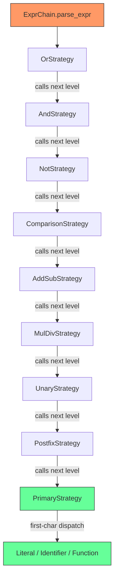
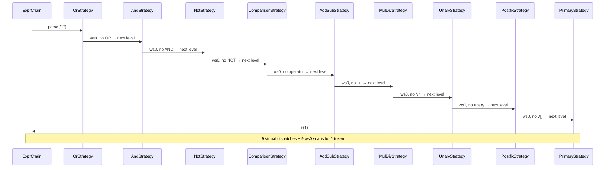
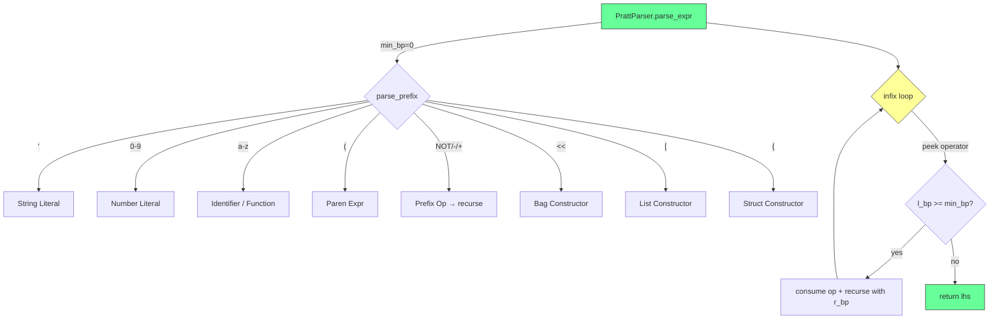
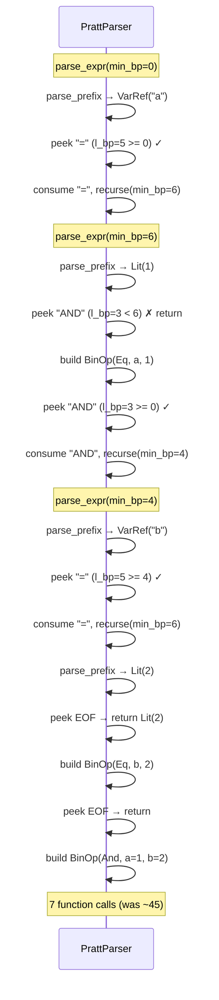
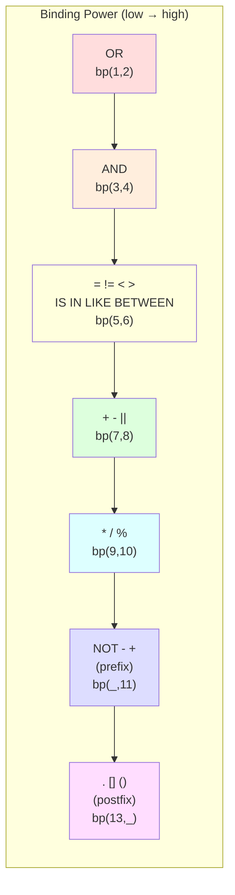
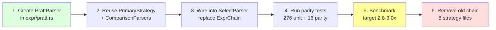
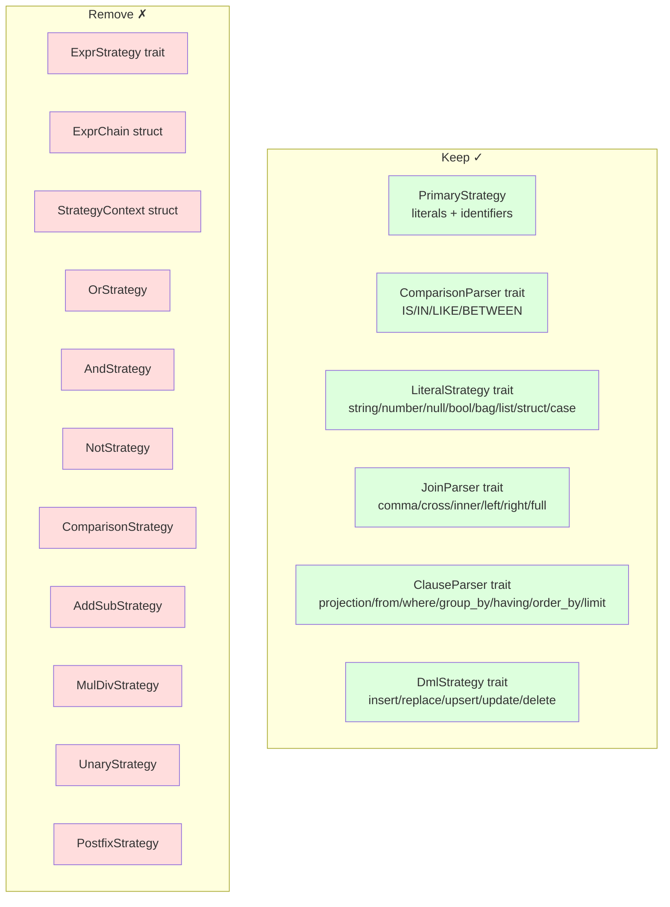

# ADR-003: Pratt Parser for Expression Engine

**Status**: Proposed
**Date**: 2026-04-08
**Branch**: `feature/winnow-parser`

## Context

The winnow parser currently uses a **recursive chain of 9 ExprStrategy levels** for expression parsing. Each level is a separate trait object with virtual dispatch.

### Current Architecture — Recursive Chain

### Problem: Simple Literal Traversal

For a simple expression like `1`, the parser traverses all 9 levels doing nothing:

### Call Count Comparison

| Expression | Chain (current) | Pratt (proposed) |
|---|---|---|
| `1` (literal) | 9 calls | 1 call |
| `'hello'` | 9 calls | 1 call |
| `a = 1` | 20 calls | 3 calls |
| `a = 1 AND b = 2` | 45 calls | 7 calls |
| `a + b * c` | 30 calls | 5 calls |
| `p.id = 'x' AND p.platform = 'MS'` | 55 calls | 9 calls |

### Estimated Impact

ExprChain recursion accounts for **12-20%** of total parse time. Eliminating it would push the parser from **2.3x** to **2.8-3.0x** faster than LALRPOP.

## Decision

Replace the recursive `ExprStrategy` chain with a **Pratt parser** (top-down operator precedence parser).

### Proposed Architecture — Pratt Parser

### Pratt Parser Flow for `a = 1 AND b = 2`

### Binding Power Table

### Migration Plan

### What We Keep vs Remove

## Consequences

### Positive
- **30-40% fewer function calls** for typical expressions
- **No virtual dispatch** for operator precedence
- **Single loop** instead of 9-level recursion
- **Simpler code** — one file instead of 8 strategy files
- Enables future optimizations (token lookahead, operator fusion)

### Negative
- Larger single function (Pratt parser is ~150 lines vs 8 small files)
- Less "strategy pattern" — but the pattern was causing the performance problem
- Requires careful testing to ensure precedence/associativity matches LALRPOP parser

### Risks
- Precedence bugs — mitigated by 16 parity tests + 260 unit tests
- Special forms (IS/IN/LIKE/BETWEEN) need careful integration into the Pratt loop
- Postfix `.`/`[]` chaining must handle arbitrary depth

## Key Files

| File | Change |
|------|--------|
| `partiql-winnow-parser/src/expr/pratt.rs` | New: Pratt parser implementation |
| `partiql-winnow-parser/src/expr/mod.rs` | Replace `ExprChain` with `PrattParser` |
| `partiql-winnow-parser/src/expr/primary_strategy.rs` | Keep: prefix parsing (literals, identifiers, functions) |
| `partiql-winnow-parser/src/expr/comparison/` | Keep: IS/IN/LIKE/BETWEEN special forms |
| `partiql-winnow-parser/src/select/select_parser.rs` | Wire `PrattParser` instead of `ExprChain` |
| `partiql-winnow-parser/src/expr/or_strategy.rs` | Remove |
| `partiql-winnow-parser/src/expr/and_strategy.rs` | Remove |
| `partiql-winnow-parser/src/expr/not_strategy.rs` | Remove |
| `partiql-winnow-parser/src/expr/comparison_strategy.rs` | Remove (operators move to Pratt loop) |
| `partiql-winnow-parser/src/expr/add_sub_strategy.rs` | Remove |
| `partiql-winnow-parser/src/expr/mul_div_strategy.rs` | Remove |
| `partiql-winnow-parser/src/expr/unary_strategy.rs` | Remove |
| `partiql-winnow-parser/src/expr/postfix_strategy.rs` | Remove |

## References

- [Pratt Parsing Made Easy](https://matklad.github.io/2020/04/13/simple-but-powerful-pratt-parsing.html) — matklad (rust-analyzer author)
- [Simple but Powerful Pratt Parsing](https://journal.stuffwithstuff.com/2011/03/19/pratt-parsers-expression-parsing-made-easy/) — Bob Nystrom (Crafting Interpreters)
